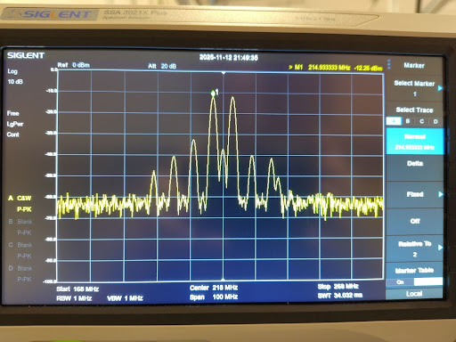
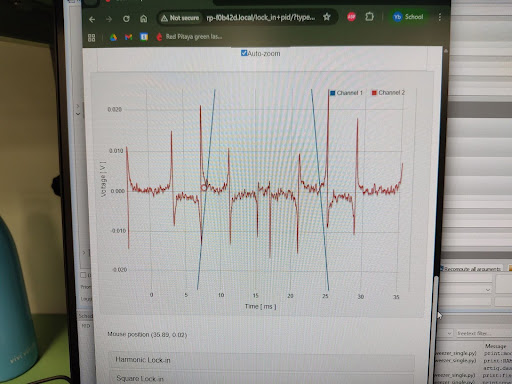

# RedPitaya ULE cavity lock

This is our implementation of the ULE cavity lock using RedPitaya (STEMLab 125-14, generation 1 with OS 2.07).

This work is based on the [lock-in and PID code by Marcelo Alejandro Luda](https://marceluda.github.io/rp_lock-in_pid/). 

We have modified the [original source on github](https://github.com/marceluda/rp_lock-in_pid) by replacing the square lock-in modulation with a sine-wave modulation of maximum 64MHz (Shannon sampling limit), and demodulation with arbitrary frequency (typically an integer multiple of the modulation frequency), and we have updated to code to run on RedPitaya OS 2.0 (see notes on calibration below). These modifications are similar to [the high-frequency harmonic lock version](https://github.com/marceluda/rp_lock-in_pid_h_hf), but allows to go to higher frequency.

## Overview

We have a 556nm laser (Toptica/Azurlight) used for cooling and trapping Yb-174 or Yb-171 atoms in a magneto-optic trap (MOT) loaded from an atomic beam coming from an oven and 2D MOT (operated at the wide 399nm transition). Since the linewidth of the 556nm transition is relative narrow (~180kHz) direct absorption spectroscopy on the atomic source is difficult, and we use an ultra-low-expansion cavity (ULE cavity from Menlo Systems) to stabilize the 556nm laser with the Pound-Drever-Hall (PDH) scheme.

The RedPitaya board provides everything reqiured for the PDH scheme: it generates the modulation signal, it demodulates the reflected signal form the ULE cavity to generate the error signal, and it implements the PID (proportional, integral, derivative) filter to generate the feedback signal for the laser piezo. 

The offset of the laser from the TEM00 resonance of the ULE cavity is adjusted by a fiber-coupled EOM (electro-optic modulator, Jenoptic PM1064). The offset frequency of order ±500MHz (-3dBm to 0dBm) is generated by an independent function generator. 

The PDH scheme needs an additional modulation frequency (3MHz, +5dBm) which is generated by the RedPitaya board and mixed (using minicircuits ZFM-150+) with the offset frequency, see image below. The mixed signal is amplified (using minicircuits ZHL-1-2W, ca. +20dBm to +23dBm output) and sent to the EOM. We are actually using the 2nd order sidebands of the EOM to lock the laser. This allows us to gap the 3GHz free-spectral range of the ULE cavity.

Changing the offset frequency we can choose between the different species: Yb-174 at the +2nd sideband with offset frequency 2x 492.02MHz (laser red-detuned from the ULE resonance), Yb-171 at the -2nd sideband with -2x 460-470MHz (laser blue-detuned from the ULE resonance; the exact frequency still has to be determined).

Example mixed signal before amplification:
 

## Setup of RedPitaya board

Here the instructions how to setup the lockin and PID source on your RedPitaya.

Copy the source folder on you local computer. Either download the compressed file and uncompress or use:

        git clone https://github.com/INO-quantum/RedPitaya_ULE_cavity_lock

Enter the newly copied repo:

        cd RedPitaya_ULE_cavity_lock

Power up your RedPitaya and check that you can connect to it with Ethernet in a browser using for `xxxxxx` the last 6 hex digits of the MAC address. This should display the RedPitaya screen with all apps:

        http://rp-xxxxxx.local

In a console/terminal SSH into your board using your root user password (if not setup its `root`):

        ssh root@rp-xxxxxx.local
        
Allow changes to the file system and exit from the SSH session:

        rw
        exit

Copy all source files and folders to the RedPitaya using SCP and your root password:

        scp -r lock_in+pid root@rp-xxxxxx.local:/opt/redpitaya/www/apps/lock_in+pid

Enter again with SSH and cd into the new lockin_in+pid folder:

        ssh root@rp-xxxxxx.local
        cd /opt/redpitaya/www/apps/lock_in+pid/src
        
Compile the controllerhf.so library on the board using make:
        
        make clean && make

Verify that in the lock_in+pid folder there is a new controllerhf.so file with the current date and time.
  
        cd ..
        ls -l
        date  
  
For the changes to take effect you have to reboot the RedPitaya:
  
        reboot
        
This will automatically `exit` from the SSH session and after a few seconds reload the list of apps in the browser and you should find the `lockin+pid` application icon. 

## Error signal and locking of laser

You can use the provided `RedPitaya_556nm_config.json` for the first setup.

If not already done, connect to the RedPitaya with a Browser at address `http://rp-xxxxxx.local` with `xxxxxx` the last 6 hex digits of the MAC address of your board. Click on the `Lockin+pid` application icon and select `configure` and load the `RedPitaya_556nm_config.json` file. The (3MHz) sine modulation signal should be active on `Out 1`. Navigate down to `Lock control` and select the `Scan enable` button after which a ~30Hz, 244mVpp (the true value is around 300mVpp), triangle signal should be output on `Out 2` which is also the PID output. To select the locking point click below on `Choose from graph` and in the scope frame click where the ramp intersects with the x-axis. This also scales the window into a good x-range but most likely you want to zoom into the error signal in the `Range` tab and `Y axis` ± buttons. Connect the photodetector signal to `In 1` - ensure that the signal is not larger than 2Vpp when using the LV settings. You might need to adapt your settings for your system. When the cavity is aligned well you should get an error signal as in the figure below:
 

 
The error signal should have a zero crossing with positive slope, otherwise change the phase in the `Lock-in modules` tab and `Fast square lock-in` section. To lock the laser on the error signal manually adjust the offset frequency for the zero crossing close to the selected locking point and click `Trigger Lock`. The button `Scan enable` should change to not selected and `PID B enable` should be selected indicating that the 2nd PID is active. Locking requires that you setup your PID settings accordingly on the `PID modules` tab. This depends on the laser used. Sometimes the board does not lock immediately, most of the time just retry or slightly adjust the frequency offset.

> [!ATTENTION]
> If your Reditaya board is accessible from outside of your laboratory network, change your root password with `passwd`!
  
> [!NOTE]
> The original harmonic lock-in can be still selected in the Browser (but I am not sure if this is working). Also, the new fast harmonic lockin is still called square lockin. The `HTML` file needs a bit of cleanup.

> [!NOTE]
> The code works on OS 2.0 but requires the old-style calibration! With the new-style calibration the input and error signals in the app scope is zero and without noise (or tiny noise with x512 settings in the lockin menu) even when touching the input jumpers with a finger. In this case SSH into the board and check output of `calib -rv` which should give `dataStructureId = 1` as the first output. If this is not the case reset the calibration to the old-syle with `calib -o`. After this you have to calibrate the analog channels. Before doing any changes you might want to backup your actual settings to a file with `cat calib.txt | calib -w` and call `rw` to allow changes of the file system. [See here for more details about the calibration utility](https://redpitaya.readthedocs.io/en/latest/appsFeatures/command_line_tools/utils/calib_util.html#calibration-utility).

> [!NOTE]
> It would be nice to adapt the code to incorporate the new-style OS 2.0 calibration and app layout using the official [scope and generator app](https://github.com/RedPitaya/RedPitaya/tree/master/apps-tools/scopegenpro). It looks like a completely new app and I am not sure if I have the time to do this.

> [!WARNING]
> This repo is still under construction! Numbers need to be checked. This should be finished soon.

