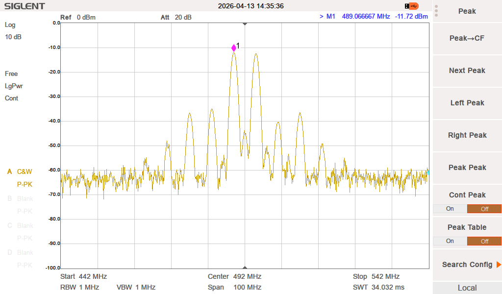
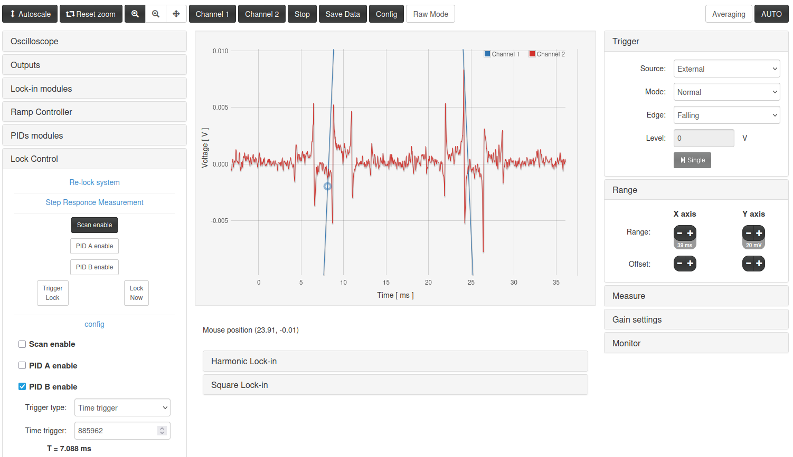

# RedPitaya ULE cavity lock

This is our implementation of the ULE cavity lock of the 556nm laser for magneto-optical trapping of Ytterbium atoms using RedPitaya (STEMLab 125-14, generation 1, tested with OS 1.04 and 2.07).

This work is based on the [lock-in and PID code by Marcelo Alejandro Luda](https://marceluda.github.io/rp_lock-in_pid/). 

We have modified the [original source on github](https://github.com/marceluda/rp_lock-in_pid) by replacing the square lock-in modulation with a sine-wave modulation of maximum 64MHz (Nyquist-Shannon sampling limit), and demodulation with arbitrary frequency (typically an integer multiple of the modulation frequency), and we have updated to code to run on RedPitaya OS 2.0 (see notes on calibration below). These modifications are similar to [the high-frequency harmonic lock version](https://github.com/marceluda/rp_lock-in_pid_h_hf), but allow to go to higher frequency and arbitrary demodulation.

## Project structure

Here an overview of the project file structure, where folders with [*] indicating that files have been changed with respect to the original source. The `lock_in+pid` folder has to be copied to the RedPitaya board - see section `Setup of the RedPitaya board`. The `fpga` folder has been removed from `lock_in+pid` since it does not need to be uploaded on the board.

```
├── fpga                    FPGA source [*]
│   ├── ip                  board generation script [*]
│   ├── rtl                 (System) Verilog source files [*]
│   │   └── lock            (System) Verilog source files [*]
│   └── sdc                 constraint file
├── images                  images for readme [*]
└── lock_in+pid             source file folder to be copied on RP board [*]
    ├── css                 style sheets
    ├── doc                 documentation
    ├── info                info.json [*] and original icons
    │   └── icon            icons for OS 2.0 [*]
    ├── js                  java script files
    ├── py                  python files
    └── src                 C source files for controllerhf.so [*]
```

## Overview

We have a 556nm laser (NKT/Toptica/Azurlight) used for cooling and trapping Yb-174 or Yb-171 atoms in a magneto-optic trap (MOT) loaded from an atomic beam origniating from an oven and 2D MOT operated at the wide 399nm transition, [for a foto of the green and blue-violet lasers see here](https://github.com/INO-quantum/scanning-cavity-lock). Since the linewidth of the 556nm transition is relative narrow (~180kHz) direct absorption spectroscopy on the atomic source is difficult, and we use an ultra-low-expansion cavity (ULE cavity from Menlo Systems, FSR 3GHz, finesse > 30k) to stabilize the 556nm laser with the Pound-Drever-Hall (PDH) scheme.

The RedPitaya board provides everything reqiured for the PDH scheme: it generates the modulation signal, it demodulates the reflected signal form the ULE cavity to generate the error signal, and it implements the PID (proportional, integral, derivative) filter to generate the feedback signal for the laser piezo. 

The offset of the laser from the TEM00 resonance of the ULE cavity is adjusted by a fiber-coupled EOM (electro-optic modulator, Jenoptic PM1064). The offset frequency of order ±500MHz (-5dBm to 0dBm) is generated by an independent function generator. 

The PDH scheme needs an additional modulation frequency (3MHz, +4dBm) which is generated by the RedPitaya board and mixed (using minicircuits ZFM-150+, LO=3MHz, RF=offset) with the offset frequency, see image below. The mixed signal (about -11dBm) is amplified (using minicircuits ZHL-1-2W, 33dB gain gives about +22dBm output) and sent to the EOM. We are actually using the 2nd order sidebands of the EOM to lock the laser.

Example signal after the mixer before amplification:
 


All even harmonics of the modulation are suppressed including the carrier, which causes that the transmitted power through the ULE cavity is very low when locked. The reflected and error signals (see image of error signal below) are however centered around the ULE resonance. If one locks by mistake on one of the sidebands, then the transmission is much higher.

The table below shows our settings per isotope. The Yb-171 settings have to be determined more precisely. Note that the given offset frequency is the one set on the function generator, i.e. the true laser detuning in the infrared is a factor 2x larger. The given wavelength (most likely in vacuum) is displayed on the NKT photonics user interface and is calculated by the software and not measured with a wavemeter. In order to verify that the error signal is coming from the 2nd harmonic of the EOM one can check the `sensitivity`, which gives how much the control signal for the laser piezo changes for a given change in offset frequency on the function generator. The first order requires twice, i.e. ±80MHz/V.

| isotope | offset frequency | harmonics | sensitivity | wavelength(vac.) | laser detuning |
|---------|------------------|-----------|-------------|------------------|----------------|
| Yb-174  | 492.020 MHz      | +2nd      | +40MHz/V    | 1111.6005(5)nm   | red            |
| Yb-171  | 460-470 MHz      | -2nd      | -40MHz/V    | 1111.5925nm      | blue           |

The feedback on the NKT photonics seed laser is acting on the laser piezo and is configured with `narrow modulation` (100% modulation gain with phase compensation enabled) and using the recommended differential amplifier scheme (THS4531).

> [!NOTE]
> For external modulation of the NKT photonics seed laser ensure that in the `internal modulation` settings the `signal output` checkbox is **disabled**! If this is not the case external modulation will not work, even though `external modulation` is selected! This issue had cost us a lot of time.


## Setup of RedPitaya board

Here the instructions how to setup the lock-in and PID source on your RedPitaya.

Copy the source folder on your local computer. Either download the compressed file and uncompress or use:

        git clone https://github.com/INO-quantum/RedPitaya_ULE_cavity_lock

Enter the newly copied repo:

        cd RedPitaya_ULE_cavity_lock

Power up your RedPitaya and check that you can connect to it with Ethernet in a browser using for `xxxxxx` the last 6 hexadecimal digits of the MAC address. This should display the RedPitaya screen with all apps:

        http://rp-xxxxxx.local

In a console/terminal SSH into your board using your root user password (if not setup its `root`):

        ssh root@rp-xxxxxx.local
        
Allow changes to the file system and exit from the SSH session:

        rw
        exit

Copy all source files and folders to the RedPitaya using SCP and your root password:

        scp -r lock_in+pid root@rp-xxxxxx.local:/opt/redpitaya/www/apps/lock_in+pid

Enter again with SSH and cd into the new lock_in+pid folder:

        ssh root@rp-xxxxxx.local
        cd /opt/redpitaya/www/apps/lock_in+pid/src
        
Compile the controllerhf.so library on the board using make:
        
        make clean && make

Verify that in the lock_in+pid folder there is a new controllerhf.so file with the current date and time (the board might not have the correct date and time):
  
        cd ..
        ls -l
        date  
  
For the changes to take effect you have to reboot the RedPitaya:
  
        reboot
        
This will automatically `exit` from the SSH session and after a few seconds reload the list of apps in the browser and you should find the `lock_in+pid` application icon.

> [!NOTE]
> The code was tested with RedPitaya OS 1.04 and OS 2.07, where with the newer OS the old-style calibration is required! With the new-style calibration the input and error signals in the scope is zero and without noise (tiny noise might be visible with `Amplification` set to `x512` in the `Lock-in modules` tab, `Demodulation` section). In this case SSH into the board and check output of `calib -rv` which should give `dataStructureId = 1` as the first output. If this is not the case reset the calibration to the old-style with `calib -o`. After this you have to calibrate the analog channels! Before doing any changes you might want to backup your actual settings to a file with `cat calib.txt | calib -w` and call `rw` to allow changes of the file system. [See here for more details about the calibration utility](https://redpitaya.readthedocs.io/en/latest/appsFeatures/command_line_tools/utils/calib_util.html#calibration-utility). It would be nice to adapt the code to incorporate the new-style OS 2.0 calibration using the official [scope and generator app](https://github.com/RedPitaya/RedPitaya/tree/master/apps-tools/scopegenpro) as reference, but I am not sure if I have the time to do this.

> [!WARNING]
> If your Reditaya board is accessible from outside of your laboratory network, change your root password with the `passwd` command!

## Error signal and locking of laser

You can use the provided `RedPitaya_556nm_config.json` for the initial setup.

If not already done, connect to the RedPitaya with a Browser at address `http://rp-xxxxxx.local` with `xxxxxx` the last 6 hexadecimal digits of the MAC address of your board. Click on the `Oscilloscope+Lock-in+PID` application icon and select `Config` and `Browse...` and select the `RedPitaya_556nm_config.json` file on your computer. A new configuration selection should appear at the bottom which you can `load` onto the board (not clear if its already loaded in the first step?). The (3MHz) sine modulation signal should be active on `Out 1`. Navigate down to `Lock Control` and select the `Scan enable` button after which a ~30Hz, 150mVpp triangle signal (in `Ramp Controller` it says 244mVpp) should be output on `Out 2` which is also the PID output. To select the locking point click below on `Choose from graph` and in the scope frame click where the ramp intersects with the x-axis. This also scales the window into a good x-range but most likely you want to zoom into the error signal in the `Range` tab and `Y axis` ± buttons. Connect the photodetector signal to `In 1` - ensure that the signal is not larger than 2Vpp when using the LV settings. Most likely, you need to adapt your settings for your system and to optimize the PID settings (we use `PID B`). When the cavity is aligned well you should get an error signal as in the figure below:
 

 
The error signal should have a zero crossing with positive slope for positive ramp direction (in our case exactly 180° for both isotopes), otherwise change the phase in the `Lock-in modules` tab and `Fast square lock-in` section (the `Slow harminic lock-in` is not used here). To lock the laser on the error signal manually adjust the offset frequency for the zero crossing close to the selected locking point and click `Trigger Lock`. The button `Scan enable` should change to not selected and `PID B enable` should be selected indicating that the 2nd PID is active. Locking requires that you have setup your PID settings accordingly on the `PIDs modules` tab (we do not use the `D` part). This depends on the laser used. Sometimes the board does not lock immediately, but most of the time just retry or slightly adjust the frequency offset to better center the error signal on the locking point.

## Generate the FPGA bitstream

The provided bitstreams `red_pitaya.bit` and `red_pitaya.bit.bin` usually do not need to be modified, but in case needed, below are the steps. You need to install `Vivado 2020.1` from `Xilinx` which is available free of charge for Windows and Linux (I use Ubuntu 2020.04 LTS; the compilation takes typically 50% longer on Windows). Be warned, this software is huge and there are many pitfalls and sometimes even bugs! The learning curve is steep and FPGA development can be very time consuming and frustrating. The provided script might not work on other versions of Vivado or needs to be manually adapted. Here the steps to regenerate the bitstream:

        source <path to Xilinx installation folder>/Vivado/2020.1/settings64.sh
        cd <path to RedPitaya_ULE_cavity_lock>/fpga
        make clean
        make
        
This starts the generation of the bitstream using the `red_pitaya_vivado.tcl` script in non-project mode. There will be a lot of ouput on the console (most warnings can be ignored, but not all) and takes on my laptop (Lenovo Thinkpad E14 with 8 CPU cores and 16GB memory) 10-11 minutes to complete. On success, the new `out` subfolder contains among other files a new `red_pitaya.bit` file. For RedPitaya OS 1.0 this is all what is needed to be copied into the `lock_in+pid` folder of the board.

For the RedPitaya OS 2.0 the `red_pitaya.bit` file has to be converted into an `red_pitaya.bit.bin` file using these additional commands:

        cd out
        echo -n "all:{ red_pitaya.bit }" > red_pitaya.bif
        bootgen -image red_pitaya.bif -arch zynq -process_bitstream bin -o red_pitaya.bit.bin -w

The generated `red_pitaya.bit.bin` file can now be copied into the `lock_in+pid` folder of the board.

The `lock_in+pid` folder of this repository contains already the needed files including the `index.html` file used to load the application in the Browser. In addition, the original files `red_pitaya_orig.bit` and `index_orig.html` are provided, which can be used to replace the newer version for testing purpose. Note, that the `RedPitaya_556nm_config.json` file might not work with the older files.

  
> [!NOTE]
> The `index.html` file needs some cleanup. The original harmonic lock-in can be still selected in the Browser but I am not sure if this is working. Also, the new fast harmonic lock-in is still called `square lockin` in the GUI.

